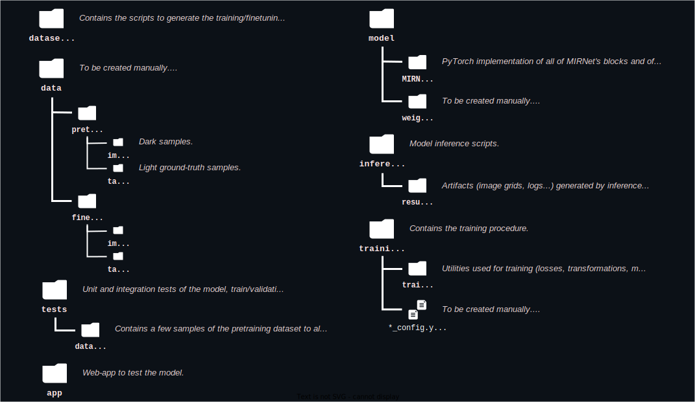
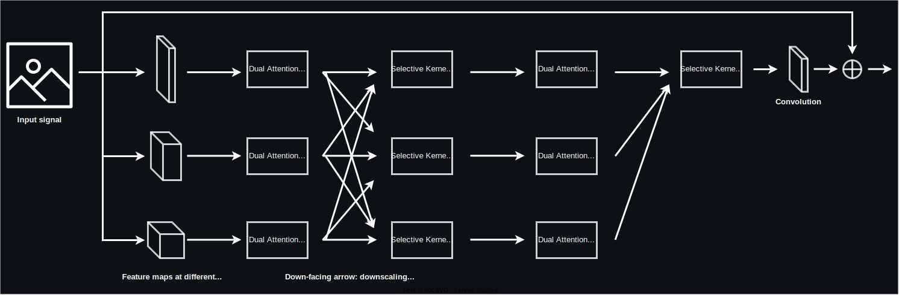

# low-light-event-img-enhancer <!-- omit from toc -->
Deep-learning-based low-light image enhancer specialized on restoring dark images from events (concerts, parties, clubs...).

## Table of contents: <!-- omit from toc -->
- [Project structure](#project-structure)
  - [The codebase](#the-codebase)
  - [The MIRNet model](#the-mirnet-model)
- [General usage of the project](#general-usage-of-the-project)
  - [Requirements](#requirements)
  - [Training the model](#training-the-model)
    - [Pre-training](#pre-training)
    - [Fine-tuning](#fine-tuning)
  - [Running the model for inference](#running-the-model-for-inference)
    - [Inference on a directory of images](#inference-on-a-directory-of-images)
    - [Inference on a single image](#inference-on-a-single-image)
  - [Generating the datasets](#generating-the-datasets)
    - [Pre-training dataset](#pre-training-dataset)
    - [Fine-tuning dataset](#fine-tuning-dataset)
  - [Running tests](#running-tests)
- [Usage of the web-application based on the model](#usage-of-the-web-application-based-on-the-model)
  - [Running the inference endpoint](#running-the-inference-endpoint)
  - [Running the web application](#running-the-web-application)

## Applied Deep Learning course
The deliverables for *Assignment 1 - Initiate* are located in `milestones/initiate.md`. As for *Assignment 2 - Hacking*, the complementary information to this README that describes general usage is in `milestones/hacking.md`.

# Project structure

## The codebase
The following figure describes how the repository is structured and which additional non-versioned folders need to be created to run the project (*more details how to use the released weights or datasets are specified in [General usage of the project](#general-usage-of-the-project)*).

## The MIRNet model
The [model](https://github.com/dblasko/low-light-event-img-enhancer/blob/main/model/MIRNet/model.py) is composed of multiple successive [residual recurrent groups](https://github.com/dblasko/low-light-event-img-enhancer/blob/main/model/MIRNet/ResidualRecurrentGroup.py), preceded and followed by single convolutional layers and a residual connection between the input and the output. The model in-between the residual connection generates the values to be added to the original image to enlighten it. Each residual recurrent group has a similar structure: a convolutional layer, followed by multiple [multi-scale residual blocks](https://github.com/dblasko/low-light-event-img-enhancer/blob/main/model/MIRNet/MultiScaleResidualBlock.py), and another convolutional layer followed by a residual connection to the input of the block. The multi-scale residual blocks have the following structure:

# General usage of the project
## Requirements
In a **Python 3.10** environment, install the requirements using `pip install -r requirements.txt`.

## Training the model

Training is generally done with the `training/train.py` script. Before running it, the training run must be configured in `training/config.yaml`. The configuration file contains the following parameters:
***TODO***
**TODO: specify also WANDB key, show example of tracking, describe config file necessary & optional params° etc.**

**TODO: general usage of script, from scratch BUT ALSO explain supports checkpointing & resuming a training run!**

Then, you can run the training script while pointing to your configuration file with `python training/train.py --config training/config.yaml`.
***TODO: document will be tracked in WANDB...***

### Pre-training
***TODO: Explain how to start from scratch, used LoL dataset generated in [refer to section described] but can use another as specified there. General form [describe]. document pre-training pass & commands/configs used, alternatively download weights here***

**Remind model is available in releases**

### Fine-tuning 
***TODO: Same steps as above. document fine-tuning pass & commands/configs, alternatively download weights here***

***Doc how freeze/no freeze layers etc, cf train.py***

**Remind model is available in releases**

## Running the model for inference 
**Specify in which folder there should be a model, can be gotten from (link to releases).**

### Inference on a directory of images

**TODO: explain, gives the grid + eval metrics, show example of output, explain how to use the script with example usage**

### Inference on a single image
*μTODO: implement & document**

## Generating the datasets
### Pre-training dataset
**Explain how could also use Night2Day by changing the one line for example**

### Fine-tuning dataset
**Explain choices, also rotations all horizontal & resizing, multiple iterations of adding image not exactly event too but photographic style improved performance further... show how to run the script on a raw dataset. Remind it is available in releases**

## Running tests
**Also specify all are run on commits on main through Github Actions**

# Usage of the web-application based on the model
*Coming soon.*

## Running the inference endpoint

## Running the web application
