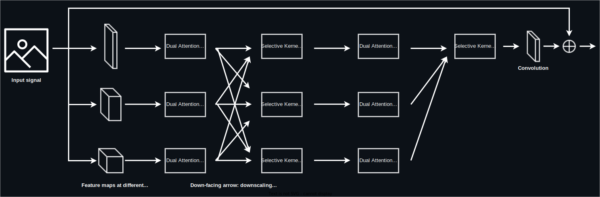

# low-light-event-img-enhancer <!-- omit from toc -->


[](https://huggingface.co/dblasko/mirnet-low-light-img-enhancement)
[](https://huggingface.co/spaces/dblasko/mirnet-low-light-img-enhancement)
[](https://hits.dwyl.com/dblasko/low-light-event-img-enhancer)

Deep-learning-based low-light image enhancer specialized on restoring dark images from events (concerts, parties, clubs...).

## Table of contents <!-- omit from toc -->
- [Project structure](#project-structure)
  - [The codebase](#the-codebase)
  - [The MIRNet model](#the-mirnet-model)
- [General usage of the project](#general-usage-of-the-project)
  - [Requirements](#requirements)
  - [Training the model](#training-the-model)
    - [Optimizing the training hyperparameters](#optimizing-the-training-hyperparameters)
    - [Pre-training](#pre-training)
    - [Fine-tuning](#fine-tuning)
  - [Running the model for inference](#running-the-model-for-inference)
    - [Inference on a single image](#inference-on-a-single-image)
    - [Inference on a directory of images](#inference-on-a-directory-of-images)
  - [Generating the datasets](#generating-the-datasets)
    - [Pre-training dataset](#pre-training-dataset)
    - [Fine-tuning dataset](#fine-tuning-dataset)
  - [Running tests](#running-tests)
- [Usage of the web-application and REST API based on the model](#usage-of-the-web-application-and-rest-api-based-on-the-model)
  - [Running the inference endpoint](#running-the-inference-endpoint)
    - [Running the endpoint locally and querying the API](#running-the-endpoint-locally-and-querying-the-api)
    - [Deploying the endpoint using Docker](#deploying-the-endpoint-using-docker)
  - [Running the web application](#running-the-web-application)


## Applied Deep Learning course
The deliverables for *Assignment 1 - Initiate* are located in `milestones/initiate.md`. As for *Assignment 2 - Hacking*, the complementary information to this README that describes general usage is in `milestones/hacking.md`.

# Project structure

## The codebase
The following figure describes how the repository is structured and which additional non-versioned folders need to be created to run the project (*more details how to use the released weights or datasets are specified in [General usage of the project](#general-usage-of-the-project)*).


## The MIRNet model
The [model](https://github.com/dblasko/low-light-event-img-enhancer/blob/main/model/MIRNet/model.py) is composed of multiple successive [residual recurrent groups](https://github.com/dblasko/low-light-event-img-enhancer/blob/main/model/MIRNet/ResidualRecurrentGroup.py), preceded and followed by single convolutional layers and a residual connection between the input and the output. The model in-between the residual connection generates the values to be added to the original image to enlighten it. Each residual recurrent group has a similar structure: a convolutional layer, followed by multiple [multi-scale residual blocks](https://github.com/dblasko/low-light-event-img-enhancer/blob/main/model/MIRNet/MultiScaleResidualBlock.py), and another convolutional layer followed by a residual connection to the input of the block. The multi-scale residual blocks have the following structure:


# General usage of the project
## Requirements
In a **Python 3.10** environment, install the requirements using `pip install -r requirements.txt`.  
In case of any version conflicts, the exact versions of the packages used during development are specified in `requirements_with_versions.txt` that you can use in the previously mentioned command.

## Training the model

Model training is generally performed with the `training/train.py` script. Before running it, the training run must be configured in `training/config.yaml` (*or any other yaml file in that directory*). The configuration file contains the following parameters:
```yaml
# *** REQUIRED SETTINGS ***
epochs: int # the number of epochs to train for.
batch_size: int 
learning_rate: float
early_stopping: bool # whether to use enable early stopping or not.
train_dataset_path: string # path to the training dataset - should contain the 'imgs' and 'targets' folders with images.
val_dataset_path: string
test_dataset_path: string
image_size: 128 # At training, random crops of (image_size//2, image_size//2) are used. At validation/testing, the smallest dimension of the image is resized to image_size while preserving the aspect ratio.

# *** OPTIONAL SETTINGS ***
from_pretrained: string # Used for finetuning: path to the pretrained model weights (.pth file).
resume_epoch: int # Used to resume training from a given checkpoint. If specified and a file in the format model/weights/Mirnet_enhance{resume_epoch}.pth exists (automatic checkpoints are named this way), the optimizer, scheduler and model states will be restored and training will resume from there up to the desired amount of epochs.
num_features: int # Number of channels to be used by the MIRNet, defaults to 64 if not specified.
num_msrb: int # Number of MSRB blocks in the MIRNet recurrent residual groups, defaults to 2.
workers: int # Number of workers to use for data loading, defaults to 8.
disable_mixup: bool # Whether to disable mixup augmentation or not. By default, mixup is enabled.
```
Then, you can run the training script while pointing to your configuration file with `python training/train.py --config training/config.yaml`.

The training procedure can be interrupted at any time, and resumed later by specifying the `resume_epoch` parameter in the configuration file. The script will automatically load the optimizer, scheduler and model states from the checkpoint file from that epoch and resume training from there as the models are automatically checkpointed at every epoch. For memory saving purposes, if the validation PSNR does not improve for 5 epochs, the checkpoints of those 5 epochs get deleted.

> [!WARNING]
> As Weights And Biases is used for experiment tracking (*logging configurations, training runs, metrics...*), your API key will be requested on the first run of the script. You can find your API key in your [WANDB account](https://wandb.ai/authorize).

### Optimizing the training hyperparameters
The hyperparameters of the training procedure can be optimized using the `training/hyperparameter_optimization.py` script. The procedure relies on WANDB Sweeps to test and compare different combinations of hyperparameters. The tuning can be run with `python training/hyperparameter_optimization.py`. The value grid, as well as the exploration method (random, Bayes, grid search...) can be further adapted at the bottom of the script.

### Pre-training

The MIRNets released in this project have first been pre-trained on the LoL dataset for 100 epochs, on 64x64 crops from images where the smallest dimension was resized to 128, but you can use the following instructions with any other dataset to pre-train on different data. 

The weights resulting from the LoL-pre-training can be obtained [from this release](https://github.com/dblasko/low-light-event-img-enhancer/releases/tag/mirnet-pretrained-LoL-1.0.0-100epochs), and the corresponding training configuration file is available [here](https://github.com/dblasko/low-light-event-img-enhancer/blob/main/training/pretraining_config.yaml). To obtain the pre-training dataset, follow the steps specified in [Generating the datasets](#generating-the-datasets) section.

To reproduce the pre-training from scratch, you can run the following command after setting up a pre-training dataset:
```bash
$ python training/train.py --config training/pretraining_config.yaml
```


### Fine-tuning

The fine-tuned model is based on the [pre-trained weights](https://github.com/dblasko/low-light-event-img-enhancer/releases/tag/mirnet-pretrained-LoL-1.0.0-100epochs) described in the previous section. It has been further trained on the [fine-tuning dataset of event-photographs](https://github.com/dblasko/low-light-event-img-enhancer/releases/tag/fine-tuning-dataset) for 100 epochs, with early-stopping (kicked in a 35 epochs), on 64x64 crops from images where the smallest dimension was resized to 128. Most of the earlier layers of the pre-trained model have been frozen for fine-tuning which led to the best results. 

The weights resulting from the fine-tuning can be obtained [from this release](https://github.com/dblasko/low-light-event-img-enhancer/releases/tag/mirnet-finetuned-1.0.0-100epochs), and the corresponding configuration file is available [here](https://github.com/dblasko/low-light-event-img-enhancer/blob/main/training/finetuning_config.yaml). To obtain the fine-tuning dataset or set up your own, follow the steps specified in [Generating the datasets](#generating-the-datasets) section.

To reproduce the fine-tuning from scratch, you can run the following command after setting up a fine-tuning dataset:
```bash
$ python training/train.py --config training/finetuning_config.yaml
```
> [!NOTE]
> For fine-tuning, the `from_pretrained` parameter in the configuration file must be set to the path of the pre-trained weights, as visible in the [fine-tuning configuration file](https://github.com/dblasko/low-light-event-img-enhancer/blob/main/training/finetuning_config.yaml) and explained in [Training the model](#training-the-model).

## Running the model for inference 
To run model inference, put the model weights in the `model/weights` folder. For example, weights of the pretrained and fine-tuned MIRNet model are available in the [releases](https://github.com/dblasko/low-light-event-img-enhancer/releases).

### Inference on a single image
To enhance a low-light image with a model, run the inference script as follows: 
```bash
$ python inference/enhance_image.py -i <path_to_input_image> 
    [-o <path_to_output_folder> -m <path_to_model>]
# or 
$ python inference/enhance_image.py --input_image_path <path_to_input_image> 
    [--output_folder_path <path_to_output_folder> --model_path <path_to_model>]
```
* If the output folder is not specified, the enhanced image is written to the directory the script is run from.
* If the model path is not specified, the default model defined in the `MODEL_PATH` constant of the script, which can be updated as needed, is used.

A typical use-case looks like this:
```
$ python inference/enhance_image.py -i data/test/low/0001.png 
    -o inference/results -m model/weights/pretrained_mirnet.pt
```

### Inference on a directory of images
To gauge how a model performs on a directory of images (*typically, the test or validation subset of a dataset*), the `inference/visualize_model_predictions.py` script can be used. It generates a grid of the original images (dark and light) and their enhanced versions produced by the model to visually evaluate performance, and computes the PSNR and Charbonnier loss on those pictures as well. 

To use the script, change the values of the three constants defined at the top of the file if needed (*`IMG_SIZE`, `NUM_FEATURES`, `MODEL_PATH` - the default values should be appropriate for most cases*), and run the script as:
```bash
$ python inference/visualize_model_predictions.py <path_to_image_folder> 
```
The image folder should contain two subfolders, `imgs` and `targets` as any split of the datasets. The script will generate a grid of the original images and their enhanced versions and save it as a png file in `inference/results`, and output the PSNR and Charbonnier loss on the dataset.

**For example, to visualize model performance on the test subset of the LoL dataset, proceed as follows:**
```bash
$ python inference/visualize_model_predictions.py data/pretraining/test
-> mps device detected.
100%|████████████████████████████████████████████████████████████████| 1/1 [00:05<00:00,  5.31s/it]
***Performance on the dataset:***
        Test loss: 0.10067714005708694 - Test PSNR: 19.464811325073242

```
Image produced by the script:


## Generating the datasets
To run model training or inference on the datasets used for the experiments in this project, the datasets in the right format have to be generated, or prepared datasets need to be downloaded and placed in the `data` folder. 

### Pre-training dataset
The pre-training dataset is the [LoL dataset](https://daooshee.github.io/BMVC2018website/). To download and format it in the expected format, run the dedicated script with `python dataset_generation/pretraining_generation.py`. The script downloads the dataset from HuggingFace Datasets, and generates the pre-training dataset in the `data/pretraining` folder (*created if it does not exist*) with the dark images in the `imgs` subfolder, and the ground-truth pictures in `targets`. 

To use a different dataset for pre-training, simply change the HuggingFace dataset reference following line in the following line of `dataset_generation/pretraining_generation.py`:
```
dataset = load_dataset("geekyrakshit/LoL-Dataset") # can be changed to e.g. "huggan/night2day"
```

### Fine-tuning dataset

**If you would like to directly use the processed fine-tuning dataset**, you can download it from the [corresponding release](https://github.com/dblasko/low-light-event-img-enhancer/releases/tag/fine-tuning-dataset), extract the archive and place the three `train`, `val`, and `test` folders it contains in the `data/finetuning` folder (*to be created if it does not exist*).

Otherwise, **to generate a fine-tuning dataset in the correct format**, the `dataset_generation/finetuning_generation.py` script can be used to re-generate the finetuning dataset from the original images, or to create a finetuning dataset from any photographs of any size you would like. 
To do so:
* Place your well-lit original images in a `data/finetuning/original_images` folder. Note that the images do not need to be of same size of orientation, the generation script takes care of unifying them. 
* Then, you can run the generation script with `python dataset_generation/finetuning_generation.py`, which will create the `data/finetuning/[train&val&test]` folders with the ground-truth images in a `targets` subfolder, and the corresponded low-light images in a `inputs` subfolder. The images are split into the train, validation, and test sets with a 85/10/5 ratio. 

The low-light images are generated by randomly darkening the original images by 80 to 90% of their original brightness, and then adding random gaussian noise and color-shift noise to better emulate how a photographer's camera would capture the picture in low-light conditions. For both the ground-truth and darkened images, the image's smallest dimension is then resized to 400 pixels while preserving the aspect ratio, and a center-crop of 704x400 or 400x704 (depending on the image orientation) is applied to unify the image aspect-ratios (*this leads to a 16/9 aspect-ratio, which is a standard out of most cameras*).

## Running tests
The unit and integration tests are located in the `tests` folder, and they can be run with the `pytest` command from the root directory of the project. Currently, they test the different components of the model and the full model itself, the loss function and optimizer, the data pipeline (dataset, data loader, etc.), as well as the training and testing/validation procedures.

> [!NOTE]
> All tests are run on every commit on the `main` branch through Github Actions alongside linting, and their status can be observed [here](https://github.com/dblasko/low-light-event-img-enhancer/actions).

To add further tests, simply add a new file in the `tests` folder, and name it `test_*.py` where `*` describes what you want to test. Then, add your tests in a class named `Test*`. 

# Usage of the web-application and REST API based on the model

## Running the inference endpoint

### Running the endpoint locally and querying the API
To start the inference endpoint (an API implemented with Flask), run the following command from the root directory of the project:
```bash
python app/api.py
```
The inference endpoint should then be accessible at `localhost:5000` and allow you to send POST requests with images to enhance.  

Two routes are available:
- `/enhance`: takes a single image as input and returns the enhanced version as a png file.  
    **Example usage with curl:**
    ```bash
    curl -X POST -F "image=@./img_102.png" http://localhost:5000/enhance --output ./enhanced_image.png
    ```
    **Example usage with Python requests:**
    ```python
    import requests

    response = requests.post('http://localhost:5000/enhance', files={'image': open('image.jpg', 'rb')})
    if response.status_code == 200:
        with open('enhanced_image.jpg', 'wb') as f:
            f.write(response.content)
    ```
- `/enhance_batch`: takes multiple images as input and returns a zip file containing the enhanced versions of the images as png files.  
    **Example usage with curl:**
    ```bash
    curl -X POST -F "images=@./image1.jpg" -F "images=@./image2.jpg" http://localhost:5000/batch_enhance -o batch_enhanced.zip
    ```
    **Example usage with Python requests:**
    ```python
    import requests

    files = [
        ('images', ('image1.jpg', open('image1.jpg', 'rb'), 'image/jpeg')),
        ('images', ('image2.jpg', open('image2.jpg', 'rb'), 'image/jpeg'))
    ]
    response = requests.post('http://localhost:5000/batch_enhance', files=files)
    with open('enhanced_images.zip', 'wb') as f:
            f.write(response.content)
    ```

### Deploying the endpoint using Docker
The same inference endpoint can be run without setting up the environment using the Docker image provided in the `Dockerfile` in the root directory of the project. To do so, run the following commands from the root directory of the project:
```bash
docker build -t low-light-enhancer .
docker run -p 5000:5000 low-light-enhancer
```
The image automatically downloads and sets up the model weights from the GitHub release. If you would like to use the weights of a particular release, you can specify the weight URL with the `--build-arg MODEL_URL=...` argument when building the image.

The inference endpoint should then be accessible at `<address of the machine hosting the container, localhost if it is the local machine>:5000` and allow you to send POST requests with images to enhance as described in the previous section.

## Running the web application
The application has been made accessible online as a [HuggingFace Space](https://huggingface.co/spaces/dblasko/mirnet-low-light-img-enhancement).

Alternatively, to start the inference web application locally, run the following command from the root directory of the project:
```bash
$ streamlit run app/app.py
```
The web application should then be accessible at `localhost:8501` in your browser and allow you to upload images in any size and format, enhance them and download the enhanced version:

